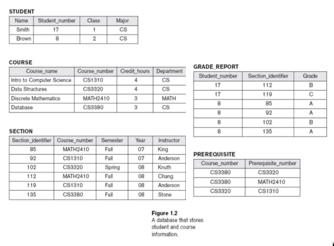

## Introduction

### Definition

A Collection of related data whose facts can be recorded and has implicit meaning

### Properties

- A database can be considered as a _miniworld_ or a _Universe of Discourse_ (UoD) as it can represent some, but not all, aspect of the world
- Logically coherent collection of data with inherent meaning, meaning that the collection of data can be used but does not exist to elicit any meaning
- A database is build for specific purpose, such as to contains general informations of students

### Database Management System (DBMS)

DBMS is a collection of programs designed to define, manipulate, retrieve, and manage data in a database. With it a user can create, and maintain a database as the users wishes

#### Example

- PostgreSQL
- MySQL
- MongoDB
- etc

### Database System

#### How it Works

1. Application program accessed the database by sending commands or queries
2. The DBMS Software processed the query
3. The Software then accessed the Meta-Data and the Stored Database
   - Meta-Data is the description of data about a particular data
   - Data is the actual data, with words, facts, measurements, etc

### Examples of Database Application

- Traditional Database Application
  Stores **textual** or **numeric** informations (Spreadsheets)
- Multimedia Databases
  Store **images**, **audio**, **clips**, and **video** streams digitally (Youtube?)
- Geographic information Systems (GIS)
  Store and analyze **maps**, **weather data**, and **satellite images** (Google maps)
- Data Warehouses and Online Analytical Processing (OLAP) Systems
  Extract and analyze useful business information from **very large databases** to support **decision making**
- Real-time and Active Database Technology
  Using real-time processing to handle workloads whose states are **constantly changing** (Waze)

### Defining a Database

Specify the **data types**, **structures**, and **constraints** of the data stored. The data would be stored as a meta-data, which would be stored in the form of a **dictionary**

### Terms

- Manipulating a database

  - Query and update database
  - Generate reports

- Sharing a database

  - Allow multiple users and programs to access the database simultaneously

- Application Program

  - Abscesses database by sending queries to DBMS

- Query

  - Data retrieval

- Transaction

  - May some data to be read or written on the database

- Protection includes

  - System protection
  - Security protection

- Maintain the database System

  - Allow the system to evolve as requirements change over time

### Examples

A University Database containing information about students, courses, and grades.

#### Data Records

1. Students
2. Courses
3. Section
4. Grade_Report
5. Prequisite

#### Specify Structure

Each records data types need to be specified and tailorsuit for each data element be it:

- String of alphabetic characters
- Integers
- Etc

#### Construct Database

There are 3 things to do in order to create the university database:

1. **Store Data** to represent each student, courses, section, grade report, and prequisite as a record in appropriate files
2. Specify the **relationship** among the records
3. **Manipulate** the database by querying or updating them

#### Picture of University Database

#### Manipulating the Database

##### Query

- Retrive the transcript
- List the names of students who took the sectionf of the 'Database' course offered in fall 2008 and their grades in that section
- List the prequisite of the 'Database' course

##### Update

- Change the class of 'Gintoki' to sophomore
- Create a new section for the 'Database' course for this semester
- Enter a grade of 'A' for 'Gintoki' in the 'Database' section of last semester

### Actors on the Scene

When interacting with the database there are several actors in play

#### Database Administrators (DBA)

They are responsible for the following:

- Authorizing **access** to the database
- **Coordinate** and **monitor** the usage of a database
- Acquiring software and hardware **resources**

#### Database Designers

They are responsible for the following:

- **Identify** the data to be stored
- **Choosing** appropriate **structures** to represent and store the database

#### End users

People whose jobs require access to the database.

- Naive or parametric end users
- Casual end users
- Sophisticated end users
- Standalone users
- Etc

#### System Analysts

Determine the **requirements** of end users.

#### Application Programmers

**Implement** the specifications as programs

### Workers Behind the Scene

#### DBMS System Designers and Implement

Design and implement the DMBS modules and interfaces as a software package

#### Tools Developers

Design and implement the tools

#### Operators and maintance personels

responsible for running and maintance of hardware and software **environment** for database system

### When We Need to Use Database

- The data is 'business' data: **large** in number, and needed to updated
- Consist of a lot similar data **(homogeneous)**
- The data is relevant for a **long time**
- **Simultaneous** usage by user

### When We don't Need to Use Database

- Simple, well-defined database application **not expected to change at all**
- **Stringent**, real-time requirements that may not be met because of DBMS overhead
- Embedded systems **with limited storage capacity**
- **No multiple-user access** to data

### When Databases Cannot be Used

- If the dabase system **can't handle the complexity** of data because of the limitation of requirements modelling
- If users **need special operation** which can not be met by the [[DBMS]]
