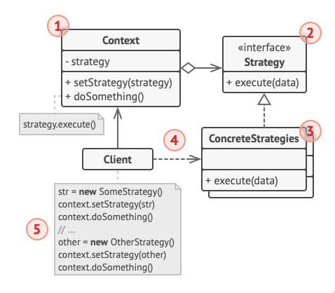

## Defintion

Strategy pattern is a #[[27bf600a]] that lets you defines a familiy of algorithms, encapsulate each one, and makes them interchangeable making each clients become **independent** in the usage of **algorithms** when needed

## Problem

Inside a navigational apps (such as waze) there's something known as route planning, with it a user should be able to traverse to their designated location as fast as possible with their current vehicles or when they are on foot. As a result of this **implementation of each algorithms** would be different between one another

One way to handle this would be to hardcoded the options (walking, bikes, etc), this would cause a massive headache in the latter part of development due to the fact that **any change to one of the algorithms will affected the whole class**. Not to mention the headache you'll get when you try to maintain the spaghetti code

## Solution

Using strategy pattern you can **take a class that does something specific in a lot of different ways and extract all of the algorithms into seperate classes**. The client (somethihng similar to a controller) would then only need to pass the desired strategy (an inteface that is common to all concrete strategies) to the context, not needing to hardcoded it and instead use an implementation of the said class (a concrete strategies, implementations of different variations of strategies) as context (a class that maintains a reference to one of the concrete strategies via strategy interface)



Basically the context would serve as a class that **holds** everything like attributes and the algorithms. The strategy is an **inteface** that's common to all concrete strategies, also known as **implementation** of strategies with plenty of variations. The client would serve as a psuedo **controller** as it's role is to create a specific strategy objects and pass them around.

## Consenquences

### Pros

- Provides encapsulation
- Hides implementation
- Allow behaviour change at runtime
- You can introducenew strategies without having to change the context (Open/Closed Principle)

### Cons

- Results in complex, hard to understand code if overused
- Clients must be aware the difference between strategies
- Useless if there's only a few variations and they hardly ever change

## Layman Explanation

Imagine an animal, they either can or can't fly. One way to create a functioning classes would be to hardcode them and declare them inside each animal. But then aliens come in play and somehow chickens are able to glide, ducks are able float, and penguins suddenly used jetpacks and do ninja stuff. Those animal classes you've created before? Well you need to change the chickens, ducks, and penguins to suit their ability to fly, not to mention the many birds suddenly can't fly, or suddenly penguins decided to float instead

This is where strategy patterns comes to the rescue, just create an interface that says "Fly", and implement it to the many variations. Then we can just attach their ability to fly to each classes

It'll probably goes like this

```java
class Animal {
    private Fly flyingType; // Types to see if it can fly

    public Fly getFlyingType() {
        return flyingType;
    }

    public void setFlyingType(Fly flyingType) {
        this.flyingType = flyingType;
    }
}

interface Fly {
    String askFlying();
}

class JetPack implements Fly {
    public String fly() {
        return "Jetpack Joyride!";
    }

}

class CanFly implements Fly {
    public String fly() {
        return "Flying Joyride!";
    }

}

class Gliding implements Fly {
    public String fly() {
        return "Gliding Joyride!";
    }

}

class FLoating implements Fly {
    public String fly() {
        return "FLoating Joyride!";
    }

}

class NoFly implements Fly {
    public String fly() {
        return "Walking Joyride!";
    }

}

class Penguins extends Animal {

    public Penguins() {
        super();
        setFlyingType(new NoFly());
    }

}

class AnimalsAfterAliens {
    public static void main(String[] args) {
        Penguins skipper = new Penguins(); // Penguins with the inability to fly
        skipper.setFlyingType(new JetPack()); // Skipper can fly with jetpack
        skipper.getFlyingType();
        skipper.setFlyingType(new FLoating()); // Skipper can float
        skipper.getFlyingType();
        skipper.setFlyingType(new Gliding()); // Skipper can glide
        skipper.getFlyingType();
    }

}
```
