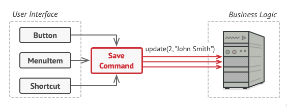
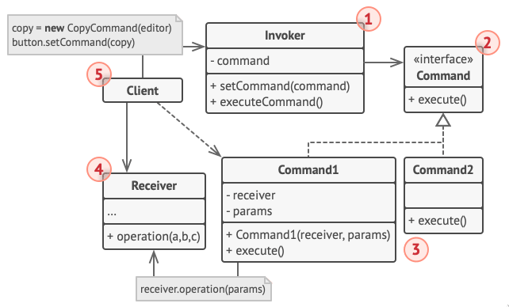
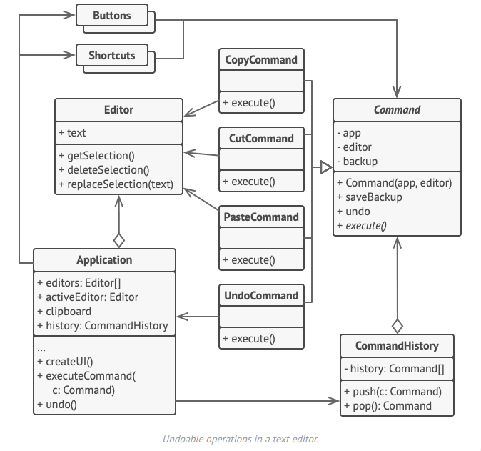

## Defintion

Command pattern is a #[[ca66aa75]] that **encapsulates a request as an object**, thereby letting you parameterise other objects with different requests, queue or log requests and support undoable operations.

## Problem

When creating a text-editor program you'll most likely try to create a toolbar that has various of functions such as saving, open, and so on. So you create a fancy button that can do various things. Most likely you'll be creating various of subclasses for various reasons. The problem with this is that sooner or latter you'll ended up with bunch of classes that you eventually lose track of it, making the chances of multiple class have the same functionality or make them easily broken with the slightest changes

## Solution

Command pattern suggest that we shouldn't send the requests directly instead we should extract all of the request details into a separate command with a single method to trigger it. The command objects would then serve as links between the buttons or shortcuts and the logics, making said buttons buttons or shortcuts to simply execute them without minding the logic behind them. After that we would need the commands to implement the same interface, usually an execute(), said interface would then let you use various commands with the same request sender without coupling it to concrete classes of commands.

What about the request parameters? Since the execute() method doesn't have any parameters we would need to either pre-configured it or making it capable of getting the parameters on it's own. In the end you'll ended up with a design that more or less looks like this

## Structure

1. The Invoker is responsible for initiation requests, it must have a field for storing a reference to a command object making it a trigger that sends the command instead of sending the request directly to the receiver
2. The Command interface is just used to declare the execution method
3. The Concrete Command (Command1/Command2) implements various kinds of request, but rather than doing it on it's own it just pass the call to one of the business logic objects. Parameters required to execute a method on a receiving objects can be declared as fields in the concrete command.
4. The Receiver class contains contains some business logic, it actually do the things instead of passing it around.
5. The Client creates and configures concrete command objects, it must pass all of the request parameters, including a receiver instance into the command's constructor

### Pseudo code

### Responsibilities

1. Client = Make command object and give it to invoker
2. Invoker = Delegate execution of command object to Receiver
3. Receiver = Execute the instructions
4. Command = Possess the instructions, and know the receiver will perform the command

## Consenquences

### Pro

- _Single Responsibility Principle_. You can decouple classes that invoke operations from classes that perform these operations.
- _Open/Closed Principle_. You can introduce new commands into the app without breaking existing client code.
- You can implement undo/redo.
- You can implement deferred execution of operations.
- You can assemble a set of simple commands into a complex one.

### Cons

- The code may become more complicated since you’re introducing a whole new layer between senders and receivers.

## Layman Explanation

Basically store lists of code that is to be executed at a later or many times. The Client would request a specific Command to run when execute() is called on an Invoker. The Invoker transfer the Command to the Receiver to execute the code.

E.g: TurnTVOn → DeviceButton → TurnTVOn → Television.TurnTVOn()
