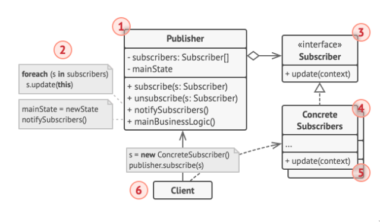

## Definition

Observer pattern is a #[[27bf600a]] that lest you define a subscription mechanism to notify multiple objects about any events that happen to the object they're observing. Think of it as a **one-to-many** dependency between the publisher to subscriber

## Problem

Customers that's interested in a particular brand would probably like to get the latest updates on the store, like if there's any discount or if there's any new items. Getting the news however is kind of troublesome, on one hand the customer could go to the store everyday which would result in a waste of time most of the time on another hand the store could spread news about their promos and items, but that would probably cause plenty of troubles to others instead (because of spamming atttack)

## Solution

Using observer pattern we can add a subscription mechanism to the publisher/subject class (the class responsible for registering, removing, and notify) which contains an array list of observers (the class that subscribe). While the observer would only serve as a view/read class



Basically the publisher/subject would serve as the class that's **responsible for the logic** as not only do they contain observers/subscribers but is also the one responsible for subscribing, unsubscribing, notify (a method that basically use the update function for every observer in the list, used when a new event happens) and other logics

The subscriber interface would serve as a skeleton for the methods to be used such as register, remove, notify, etc. The same thing applies to an interface observer.

A concrete subscribers would serve as a declarations for the interface, basically tells what the update will be doing, similar to the concrete strategies in [[9aa5ba85]].

The client would create publisher and subscriber objects and then register subscribers for publisher updates

## Consenquences

### Pros
- Abstracts coupling between Subject and Observer
- Supports broadcast communication
- Supports unexpected updates
- Enables reusability of subjects and observers independently
- Capable of introducing new subscriber classes without having to change the publisher's code and vice versa (Open/Closed Principle)
- Capable of establishing relations between objects at runtime

### Cons
- Exposes the Observer to the Subject (push model)
- Exposes the Subject to the Observer (pull model)
- Subscribers are notified in random order

## Layman Explanation
You wish to know to the updates of many novels spread out accross the internet that you read, naturally you'll need to subscribe to the latest news on said website but how does the subscription works?

[novelupdates.com](https://www.novelupdates.com) probabably can be served as an example (I don't know mate, I'm just guessing here).

```java
import java.util.ArrayList;

interface Subject {
    public void reerObserver(Observer observer);

    public void removeObserver(Observer observer);

    public void notifyObserver(Observer observer);

}

interface Observer {
    public void update(String data);

}

class NovelContainer implements Subject {
    private ArrayList<Observers> observers;
    private ArrayList<String> novels;

    public NovelContainer() {
        observers = new ArrayList();
    }

    public void registerObserver(Observer observer) {
        observers.add(observer);

    }

    public void removeObserver(Observer observer) {
        int i = observers.indexOf(observer);
        if (i >= 0)
            observers.remove(i);

    }

    public void notifyObserver() {
        for (int i = 0; i < observers.size(); i++) {
            Observer notifiedObserver = (Observer) observers.get(i);
            notifiedObserver.update("There is a novel update named " + novels.get(novels.size() - 1));
        }

    }

    public ArrayList<Observers> getObservers() {
        return observers;
    }

    public void setObservers(ArrayList<Observers> observers) {
        this.observers = observers;
    }

    public void addNovel(String title) {
        this.novels.add(title);
        notifyObserver();

    }

}

class NovelWatcher implements Observer {

    public NovelWatcher(NovelContainer novelContainer) {
        novelContainer.registerObserver(this);
    }

    @Override
    public void update(String data) {

    }

}

class NovelGet {
    public static void main(String[] args) {
        NovelContainer novelC = new NovelContainer();
        novelC.setNovels("NovelA");
        novelC.setNovels("NovelB");
        novelC.setNovels("NovelC");
        NovelWatcher novelW = new NovelWatcher(novelC);
        novelC.setNovels("NovelD");

    }

}
```
[most likely wrong though]
