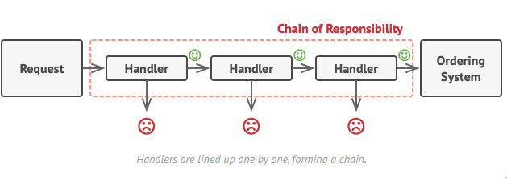

## Definition

Chain of Responsibility pattern is a #[[27bf600a]] that lets you pass requests along a chain of handlers  when upon receiving a request each handler decides either to process the request or to pass it to the next handler in the chain

## Problem

On an online ordering system you might want to restrict access to the system so that only authenticated users can create orders, and users who have administrative permissions must have full acess to all orders. At first there were check A and B, but then it was realized that it wasn't enough, and soon check C was added, and then D, and so on to the point **it all went tangled**

## Solution

Using chain of strategy patter you can easily add as many handlers you want and determine the flow of how it handles. You can choose to make it so that it starts from A to D to C and so on with ease. You can also choose to fail said object currently being handled if it didn't pass, and decided how the object should be handle in each handler

In short think of CoR as something similar to a [Linked List](https://www.javatpoint.com/singly-linked-list), you can decide **how** the handlers react, **decide** the next chain, and **what** to do if it didn't meet a requirement of a handler

## Concenquences

### Pros
- Abstracts coupling between Subject and Observer
- Supports broadcast communication
- Supports unexpected updates
- Enables reusability of subjects and observers independently

### Cons
- Exposes the Observer to the Subject (push model)
- Exposes the Subject to the Observer (pull model)

## Layman Explanation

Linked List, but not data structure
