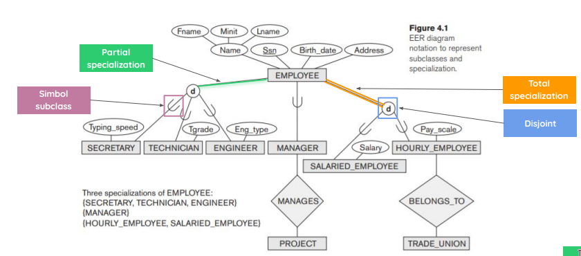
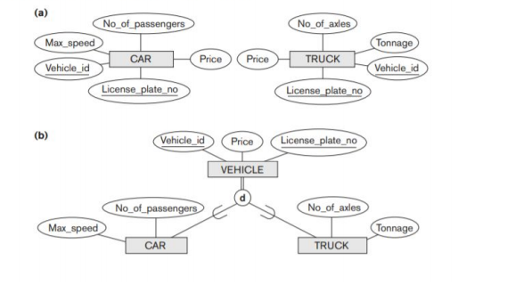
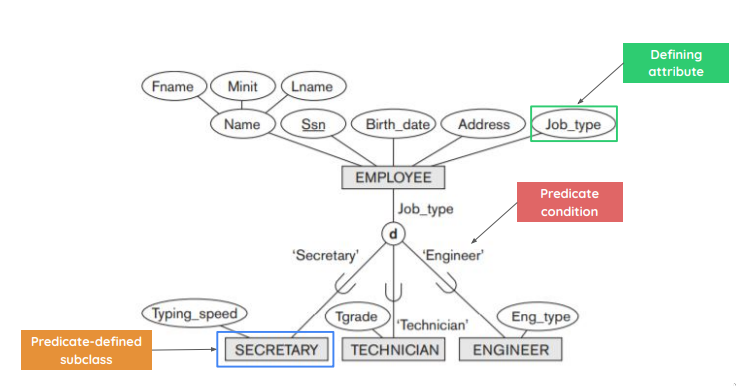
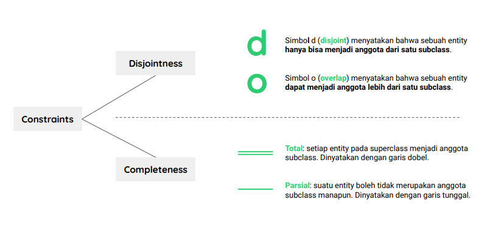
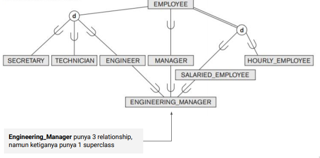
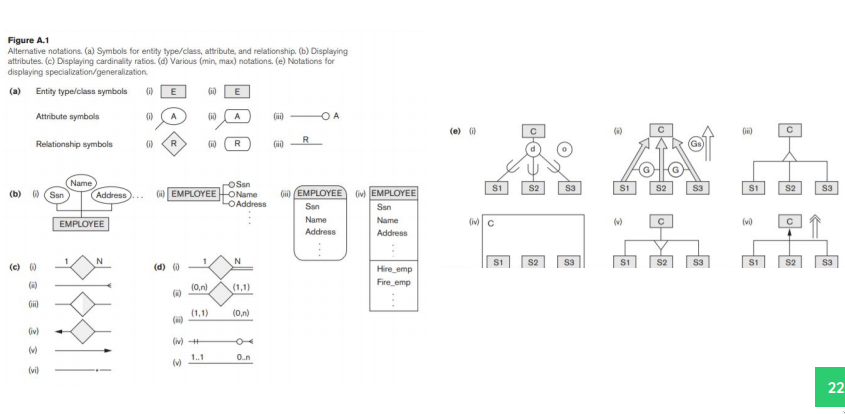

## Definition

EER is basically #[[ER-Model]] but with class extensions, as in it has subclass/superclass, specialization/generalization, categories, and inheritance. We use EER when we wanted the application to be more complete and precise.

## Subclass and Superclass

Subclass works the same way as it does in [[OOP]], as in it represent the superclass entity only it has it's specific role. A subclass entity also become a **superclass member** but not vice versa

### Type Inheritance

The subclass entity inherits the attribute and relationship of the superclass

### Specialization

Specialization is defining the subclasses of a superclass entity depending on it's characteristics. It also means that a superclass **can have multiple specialization characteristics**. Also the pointy arrows goes to the subclass.
e.g SECRETARY, ENGINEERS, TECHNICIAN are specialization of EMPLOYEE

Why should we use specialization? Well it's because:

- We can **define** the subclasses
- It **describes** a specific attribute for each subclasses
- It draws a specific relationship **between a subclass and other entity**

### Generalization

Basically reverse of specialization, e.g BIKES and CAR can be generalize into VEHICLE. Also the pointy arrows goes to the superclass.

### Constraint for Specialization and Generalization

Basically if **all members are defined use total, otherwise partial**, as well as **if every member can only choose one specialization it's a disjoint, otherwise overlap**

## Hierarchy and Lattice

- Hierarchy means that a **subclass can only have one superclass**
- Lattice means a subclass can have **multiple superclass**, e.g
  

## Category

Category or union type means that **one subclass can have more than one superclass**. The main difference between category and lattice is that categories only **inherits selected attributes and it's owner needs to be one of the many superclasses it has**, while lattice on the other hand **needs to have the owner on all superclasses and inherits all of their attributes**

## Diagram Notation

